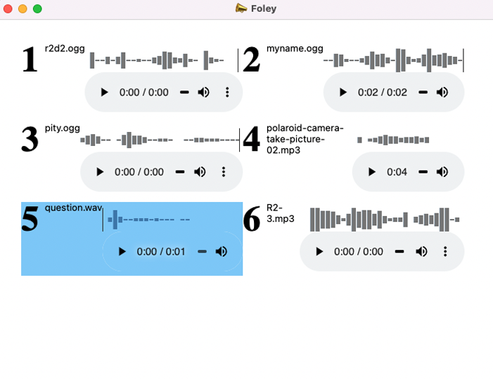

##  Foley 

Simple drag and drop soundboard.



- supports .mp3 .wav and .ogg
- stores sounds in localstorage
- keyboard shortcuts
- midi controller support
- wavesurfer visualization integration

### Prebuilt App
We're looking for people to help build this app for other platforms
- [MacOS](dist/Foley-darwin-x64-1.0.0.zip)


### Developer installation

```markdown

- `yarn install`
- `npm start`
```

### Support the project

<script type="text/javascript" src="https://cdnjs.buymeacoffee.com/1.0.0/button.prod.min.js" data-name="bmc-button" data-slug="danshahin" data-color="#FFDD00" data-emoji="" data-font="Cookie" data-text="Buy me a comic book!" data-outline-color="#000000" data-font-color="#000000" data-coffee-color="#ffffff" ></script>

